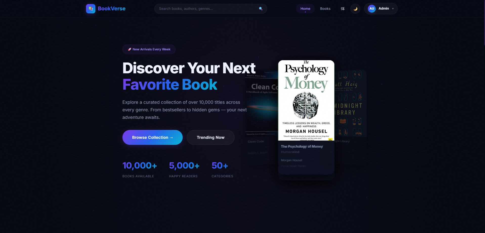
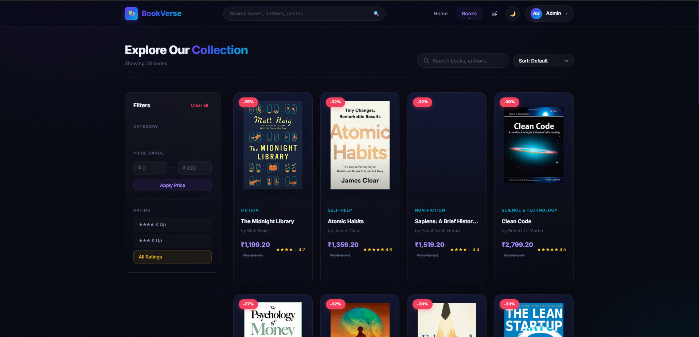
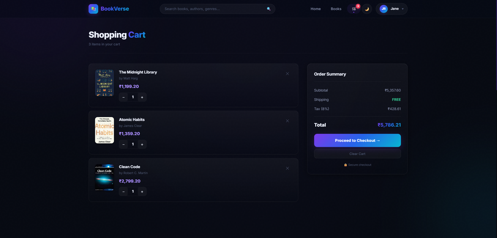
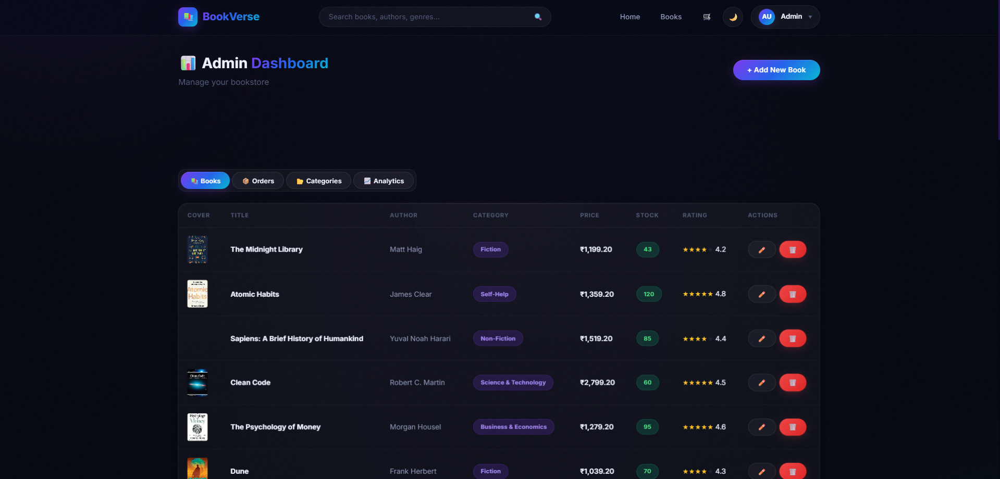
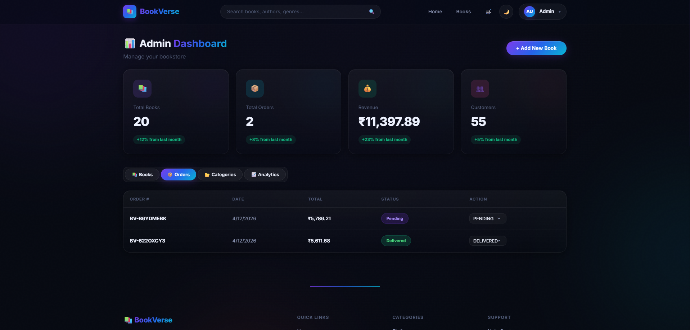

# BookVerse – Full Stack Ecommerce Bookstore

[](https://spring.io/projects/spring-boot)
[](https://openjdk.org/projects/jdk/17/)
[](https://www.mysql.com/)
[](https://developer.mozilla.org/en-US/docs/Web/JavaScript)
[](https://opensource.org/licenses/MIT)

**BookVerse** is a professional, high-performance E-commerce platform designed for modern bookstores. It features a sleek, futuristic dark-neon aesthetic and delivers a seamless shopping experience for customers while providing a powerful administrative control center for business owners.

---

## 📸 Project Previews

Explore the visual design and user flow through these snapshots:

### Customer Experience
| Home Page | Books Listing | Cart & Checkout |
| :---: | :---: | :---: |
|  |  |  |
| *Curated landing with featured books* | *Advanced filtering and searching* | *Streamlined purchase flow* |

### Administrative Dashboard
| Analytics Overview | Inventory Management | Order Fulfillment |
| :---: | :---: | :---: |
|  |  |  |
| *Real-time sales and revenue KPIs* | *Full CRUD for book inventory* | *Track and update order statuses* |

---

## 🚀 Key Features

### 👤 Customer Features
- **Dynamic Browsing**: Explore a rich library of books categorized by genre (Fiction, Tech, Business, etc.).
- **Smart Search/Filter**: Instantly find books by title, author, or description using full-text search and category filters.
- **Cart Management**: Real-time cart updates with LocalStorage persistence.
- **Secure Checkout**: Comprehensive order placement with address validation and multiple payment methods (Credit/Debit, UPI, COD).
- **Order Tracking**: Personalized order history with real-time status updates (Pending → Delivered).
- **User Authentication**: Secure registration and login system with role-based access control.

### 🛠️ Admin Features
- **Business Insights**: Dashboard showcasing total revenue, order counts, and customer growth via visual charts.
- **Inventory Control**: Add new arrivals, edit book details, manage pricing, and track stock levels.
- **Order Management**: Monitor all customer orders, view detailed shipping info, and transition orders through fulfillment stages.
- **Customer Management**: Overview of registered users and their activity.

---

## 💻 Tech Stack

### Frontend
- **Language**: Vanilla JavaScript (ES6+), HTML5, CSS3
- **Styling**: Custom CSS with Glassmorphism and Neon accents
- **Typography**: Inter & Roboto (Google Fonts)
- **Icons**: Font Awesome 6
- **Data Fetching**: Native Fetch API (RESTful interaction)

### Backend
- **Framework**: Spring Boot 3.2.0 (Java 17)
- **Persistence**: Spring Data JPA with Hibernate
- **Database**: MySQL 8.0 (Relational Data Model)
- **Build Tool**: Maven
- **Architecture**: Multi-layered (Controller, Service, Repository, Entity)

---

## 🏗️ Architecture & Data Flow

BookVerse follows a **Decoupled Client-Server Architecture**:

1. **Frontend**: A collection of static assets (HTML/CSS/JS) that interact with the backend via asynchronous REST API calls. 
2. **Backend**: A robust Spring Boot service that handles business logic, security, and data persistence.
3. **Database**: A 3rd Normal Form (3NF) relational database ensuring data integrity across users, books, and complex order structures.

**Data Flow Example (Order Process):**
- Client sends `POST /api/orders` with cart data.
- Backend validates stock levels via `BookRepository`.
- Transactional persistence saves `Order` and `OrderItems`.
- Backend returns a unique Order ID, reflecting instantly in the user's Profile.

---

## 🛠️ Installation & Setup

### 1. Prerequisites
- **Java**: JDK 17+
- **Database**: MySQL 8.0+
- **Build Tool**: Apache Maven

### 2. Database Setup
1. Create a database named `bookverse`.
2. Execute the provided `schema.sql` to initialize tables and seed data:
   ```bash
   mysql -u root -p bookverse < schema.sql
   ```

### 3. Backend Configuration
Update the Database credentials in `backend/src/main/resources/application.properties`:
```properties
spring.datasource.url=jdbc:mysql://localhost:3306/bookverse
spring.datasource.username=YOUR_USERNAME
spring.datasource.password=YOUR_PASSWORD
```

### 4. Run the Application
**Start Backend:**
```bash
cd backend
mvn spring-boot:run
```

**Start Frontend:**
Simply open `frontend/webapp/index.html` in your browser, or serve it using a local server (e.g., Live Server in VS Code).

---

## 📡 API Reference

| Endpoint | Method | Description |
| :--- | :--- | :--- |
| `/api/auth/login` | `POST` | Authenticate user and return profile |
| `/api/books` | `GET` | Retrieve all active books |
| `/api/books/{id}` | `GET` | Get detailed information for a book |
| `/api/books/search` | `GET` | Search books by query parameter |
| `/api/orders` | `POST` | Place a new customer order |
| `/api/orders/user/{id}` | `GET` | Fetch order history for a specific user |
| `/api/admin/stats` | `GET` | Aggregate data for admin dashboard |

---

## 📂 Folder Structure

```text
BookVerse/
├── backend/            # Spring Boot application source code
│   ├── src/            # Java controllers, services, repositories
│   └── pom.xml         # Maven dependencies
├── frontend/webapp/    # UI assets (HTML, CSS, JS)
│   ├── css/            # Modular stylesheets
│   ├── js/             # Interactive logic and API handlers
│   └── *.html          # Core page templates
├── screenshots/        # Project visual assets
└── schema.sql          # MySQL database schema & seed data
```

---

## 🔮 Future Enhancements
- [ ] **JWT Authentication**: Transition from simple auth to secure Token-based authentication.
- [ ] **Payment Gateway**: Integration with Stripe or Razorpay for live payments.
- [ ] **Email Notifications**: Automated order confirmation and shipping updates.
- [ ] **Wishlist**: Allow users to save books for later.

---

## 📄 License & Author
Distributed under the **MIT License**. Created by [Rohit].
